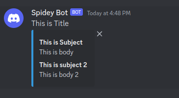
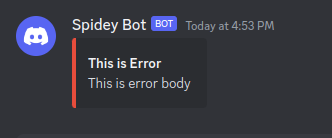

# Send message via Discord

## Installation
```shell
go get -u github.com:hamidteimouri/sdk-discord
```

## How to use
```go
package main

import (
	"fmt"
	"github.com:hamidteimouri/sdk-discord"
)

func main() {

	d := discord.NewDiscordLogger(&discord.Config{
		Webhook: "{your-webhook-is-here}",
		Title:   "Your title of message", // optional
	})
	
	err := d.Info("This is subject", "This is body", "This is subject 2", "This is body 2")
	if err != nil {
		fmt.Println("err: " + err.Error())
	}
}
```

### Sample
This is sample of the messages. <br>
- info  <br>

- Error  <br>
